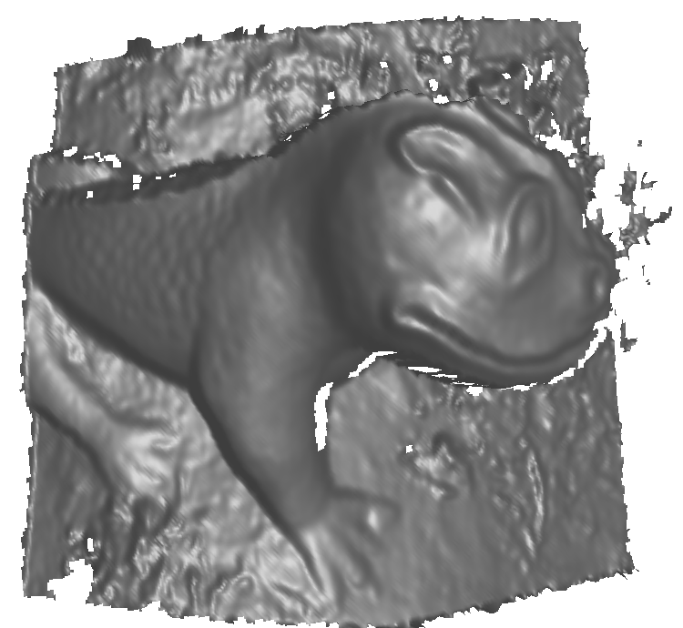

# PIXELMAP Framework

## 📄 **White Paper**
For a detailed explanation of the PIXELMAP framework, including methodology, experiments, and results, refer to our **[White Paper](https://doi.org/10.36227/techrxiv.173749998.89779329/v1)**.

---

## 🌐 **Interactive Website**
Explore PIXELMAP in action with our **[Interactive Demo](https://pixelmap.dogduck.com/)**, where you can upload your own images and visualize the dense correspondence mappings in real-time.


## Open source implementation in Rust

[](https://crates.io/crates/pixelmap)
[](https://docs.rs/pixelmap)

The algorithm is published as the **[`pixelmap`](https://crates.io/crates/pixelmap)**
crate — a dependency-light library that takes two photos and returns the dense mapping
between them ([API docs](https://docs.rs/pixelmap), and
[rust/pixelmap/README.md](rust/pixelmap/README.md)).

```toml
[dependencies]
pixelmap = "0.1"
```

The rest of the [rust](rust) folder builds on it: a command line tool that writes the
interpolated images to disc, a viewer that animates them in a window, and
`pixelmap_model_3d`, which lifts a finished mapping into a textured 3D mesh.


---

**Swarm Intelligence for Dense Image Correspondence**

The **PIXELMAP** framework leverages **swarm intelligence** and **iterative refinement strategies** to establish **dense, robust, and accurate image correspondences**. By conceptualizing each grid cell in an **Affine Correspondence Grid (AC-Grid)** as an autonomous "agent," PIXELMAP iteratively refines local affine transformations and ensures global geometric consistency.

This approach is highly effective for tasks such as:
- **3D Reconstruction**
- **Stereo Matching**
- **Image Stitching**
- **Optical Flow**

---

## 📚 **Overview**
PIXELMAP introduces a novel approach by combining **Correspondence Mapping (CM)** and **Iterative Refinement (IR)**:

- **Correspondence Mapping (CM):** Swarm-inspired dynamics enable local optimizations through agent-based collaboration.
- **Iterative Refinement (IR):** Ensures global consistency by smoothing and refining affine transformations across neighboring grid cells.
- **Affine Correspondence Grid (AC-Grid):** A structured grid representation that balances local adaptability with global coherence.

This synergy results in accurate pixel-to-pixel mappings, even in challenging conditions such as occlusions, geometric distortions, and varying lighting.

---

## 🖼️ **Key Figures**

### Example 1: Monkey Statue Correspondence Mapping


### Example 2: Monument Correspondence Mapping


### Example 3: Statue 3D Reconstruction


### Example 4: Grid Size Comparison on Tree Photos


---


## 🚀 **Getting Started**
See build instructions inside the [rust](rust) folder.

---

## 📜 **License**
This project is licensed under the **MIT License** — see the **LICENSE** file for details.

---

For questions or collaborations, feel free to reach out or open an issue. 🚀
