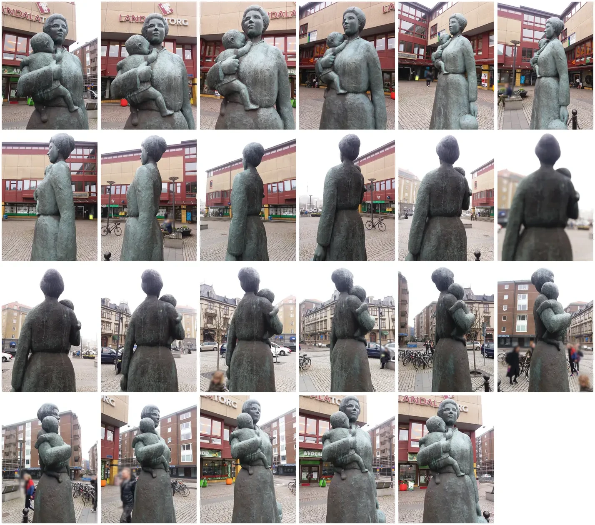
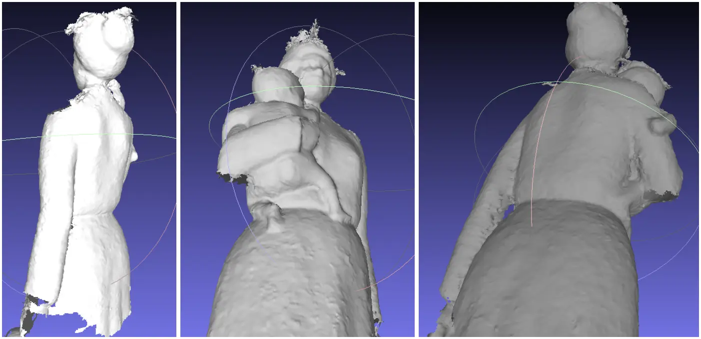
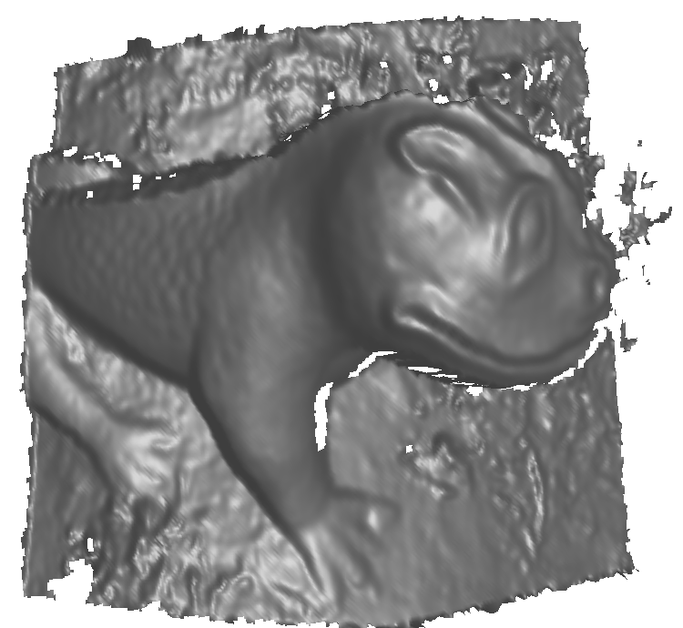

# PIXELMAP

[](https://pypi.org/project/pixelmap-python/)
[](https://pypi.org/project/pixelmap-multiview-python/)
[](https://crates.io/crates/pixelmap)
[](https://crates.io/crates/pixelmap_multiview)
[](LICENSE)

**Dense correspondence mapping between photos.** Given two photographs of the same scene, PIXELMAP works out where each pixel of the first one went in the second. Given three or more, it can go on to recover the camera positions and build a textured 3D model.

This repository holds the reference implementation in Rust, together with the white paper's example material.


- **White paper:** [PIXELMAP on TechRxiv](https://doi.org/10.36227/techrxiv.173749998.89779329/v1)
- **Interactive demo:** [pixelmap.dogduck.com](https://pixelmap.dogduck.com/) — upload your own images and inspect the mapping in the browser

## Try it

The algorithm is published as ready-made packages, so you can test it without cloning or building anything.

| Package | What it does | Install |
| --- | --- | --- |
| [`pixelmap-python`](https://pypi.org/project/pixelmap-python/) | Dense correspondence between two photos | `pip install pixelmap-python` |
| [`pixelmap-multiview-python`](https://pypi.org/project/pixelmap-multiview-python/) | 3D reconstruction from three or more photos | `pip install pixelmap-multiview-python` |
| [`pixelmap`](https://crates.io/crates/pixelmap) (Rust) | Dense correspondence between two photos | `cargo add pixelmap` |
| [`pixelmap_multiview`](https://crates.io/crates/pixelmap_multiview) (Rust) | 3D reconstruction from three or more photos | `cargo add pixelmap_multiview` |

The Python packages ship prebuilt wheels for Linux (x86-64, aarch64, musl), macOS (Apple silicon and Intel) and Windows (x86-64), for CPython 3.9 and newer. No Rust toolchain is needed.

### Python: two photos

```bash
pip install pixelmap-python
```

The distribution is called `pixelmap-python`, but the module is imported as `pixelmap`.

```python
import numpy as np
import pixelmap
from PIL import Image

a = np.asarray(Image.open("a.jpg").convert("RGB"))
b = np.asarray(Image.open("b.jpg").convert("RGB"))  # same dimensions as a

mapping = pixelmap.correspond(a, b, quality="low")

flow = mapping.flow()  # (H, W, 2) float32: how far each pixel moved; NaN where unmapped
print(f"{mapping.coverage:.1%} of the image was mapped")
print(mapping.lookup(120.0, 84.0))  # where the pixel at (120, 84) ended up, or None
```

### Python: three or more photos

```bash
pip install "pixelmap-multiview-python[images]"   # [images] adds Pillow for load_photos()
```

The module is imported as `pixelmap_multiview`.

```python
import pixelmap_multiview as pmv

photos, focal = pmv.load_photos(["a.jpg", "b.jpg", "c.jpg", "d.jpg"])
model = pmv.reconstruct(photos, quality="medium", focal_35mm=focal)

model.save("out/model.obj")  # textured mesh, opens in MeshLab or Blender
```

No calibration, markers or measurements are needed. Twenty-three phone photos taken while walking once around a statue:



and the mesh fused from them:



### Rust

```bash
cargo add pixelmap              # two-photo correspondence
cargo add pixelmap_multiview    # multi-view 3D reconstruction
```

See the API documentation on [docs.rs/pixelmap](https://docs.rs/pixelmap) and [docs.rs/pixelmap_multiview](https://docs.rs/pixelmap_multiview) for usage.

## How it works

PIXELMAP establishes dense correspondences through swarm intelligence and iterative refinement on an **Affine Correspondence Grid (AC-Grid)**.

Each cell of the grid acts as an autonomous agent that holds its own local affine transformation. Two mechanisms work together:

- **Correspondence Mapping (CM).** Agents refine their transformation against the image data and pass what they find on to their neighbours.
- **Iterative Refinement (IR).** Transformations are smoothed across neighbouring cells, and a forward/backward consistency check removes agents that disagree.

Repeating this from coarse to fine resolution yields a dense mapping that is both locally accurate and geometrically consistent, even with occlusions, perspective distortion and changes in lighting. Regions that cannot be matched reliably are reported as unmapped rather than given a plausible-looking but wrong coordinate.

Typical applications include 3D reconstruction, stereo matching, image registration and stitching, optical flow, and morphing.

## Examples

### Correspondence on a monument


### 3D reconstruction of a statue



### Effect of grid size

The same pair of tree photos mapped with different grid sizes.


## Building from source

The Rust source is in the [`rust`](rust) folder, which also contains build instructions.

The Python bindings live in separate repositories: [pixelmap-python](https://github.com/d4per/pixelmap-python) and [pixelmap-multiview-python](https://github.com/d4per/pixelmap-multiview-python).

## License

MIT. See [LICENSE](LICENSE).

Questions and contributions are welcome: please open an issue or a pull request.